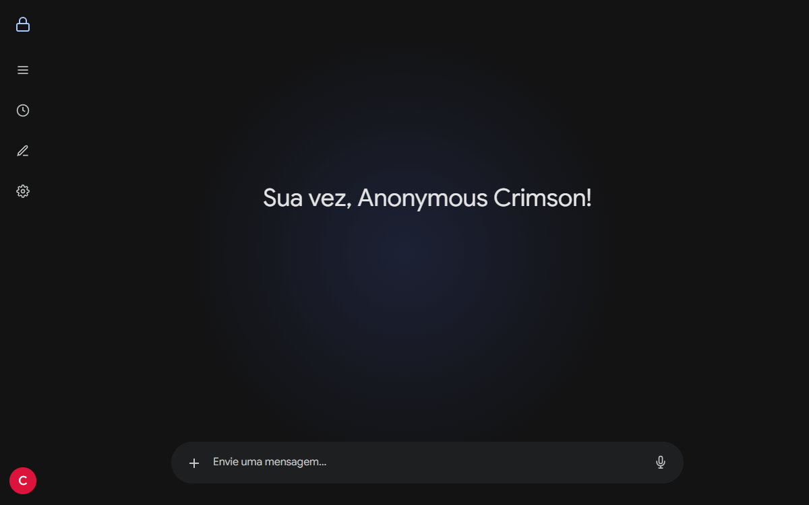

<h1 align="center">
  
</h1>

  

## [  About Me ]

   Final-year <strong>Systems Analysis and Development (ADS)</strong> undergraduate at <strong>IFSP (Federal Institute of São Paulo)</strong>.  
   <strong>Full Stack Developer</strong> specializing in web applications, backend APIs, and automation using <strong>Python, JavaScript, and C++</strong>.  
   Hands-on experience with <strong>Linux environments, Docker containerization, reverse proxies (Nginx), and Cloud Infrastructure (Oracle Cloud)</strong>.  
   Passionate about <strong>Computer Architecture, Embedded Systems (ESP32, M5StickC), and Hardware Optimization</strong>.  
   <strong>Location:</strong> Brazil | Open for Remote and Hybrid Junior and Internship Opportunities.

## [  Tech Stack ]

### Core Languages & Web

  
  
  
  
  
  
  
  

### Backend, APIs & Infrastructure

  
  
  
  
  
  
  
  
  
  
  
  
  

### Embedded & Hardware

  
  
  

---

## [  Top Repositories ]

<table align="center" width="100%">
  <tr>
    <td width="50%" valign="top">
      <h3> <a href="https://github.com/comeraperuibe944/JDWebcam">JDWebcam</a></h3>
      
Transforms regular webcams into virtual motion controllers via computer vision in Python. Enables direct gameplay without external sensor hardware.

      
<strong>Technologies:</strong> Python, Computer Vision, Virtual Input Emulation

    </td>
    <td width="50%" valign="top">
      <h3> <a href="https://github.com/comeraperuibe944/StickController">StickController</a></h3>
      
Custom C++ embedded firmware that turns an M5StickC Plus2 into an Xbox input controller with wireless access point connectivity.

      
<strong>Technologies:</strong> C++, ESP32, Embedded Systems, Wi-Fi Networking

    </td>
  </tr>
</table>

## [  Featured Work & Deployments ]

<table align="center" style="border-collapse: collapse;">
  <tr>
    <td align="center" width="50%">
      
       <strong>Undertale GB (GameDev & Chiptune)</strong>
       Core Contributor & Composer for Undertale Game Boy Color project. Custom audio synthesis and retro demake.
    </td>
    <td align="center" width="50%">
      
       <strong>Cloud Server Dashboard & Web PTY</strong>
       Production server manager with interactive WebSocket terminal, FastAPI, and Nginx on Oracle Cloud.
    </td>
  </tr>
  <tr>
    <td align="center" width="50%">
      
       <strong>zkchat (Zero-Knowledge Protocol)</strong>
       Encrypted peer-to-peer web chat with client-side cryptography.
    </td>
    <td align="center" width="50%">
      
       <strong>Mapeamento Cultural</strong>
       Interactive cultural mapping web application with geo-coordinates and search.
    </td>
  </tr>
  <tr>
    <td align="center" colspan="2">
      
       <strong>Carnaval Feminino</strong>
       Interactive cultural narrative platform developed for community engagement.
    </td>
  </tr>
</table>

---

## [  Hardware, Audio & Creative Engineering ]

<table align="center" style="border-collapse: collapse;">
  <tr>
    <td align="center" width="50%">
      
       <strong>M5StickC Plus2 Developer</strong> 
      IoT automation, embedded controller firmware, and custom builds published on <a href="https://m5burner.m5stack.com/">M5Burner</a>.
    </td>
    <td align="center" width="50%">
      
       
       <strong>Chiptune & Game Development</strong> 
      Core Contributor & Composer for <a href="https://blaqberry.itch.io/undertale-gbc">Undertale GB (GBC)</a> and maintainer of custom audio synthesis tools.
    </td>
  </tr>
</table>

### Retro Architecture & Interests

  
  
  
  
  
  
  
  

## [  Activity & Contributions ]

  

<picture>
  <source media="(prefers-color-scheme: dark)" srcset="https://raw.githubusercontent.com/comeraperuibe944/comeraperuibe944/output/github-contribution-grid-snake-dark.svg">
  <source media="(prefers-color-scheme: light)" srcset="https://raw.githubusercontent.com/comeraperuibe944/comeraperuibe944/output/github-contribution-grid-snake.svg">
  
</picture>

  
  
  
  
  

  

