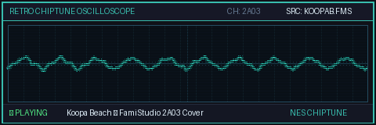
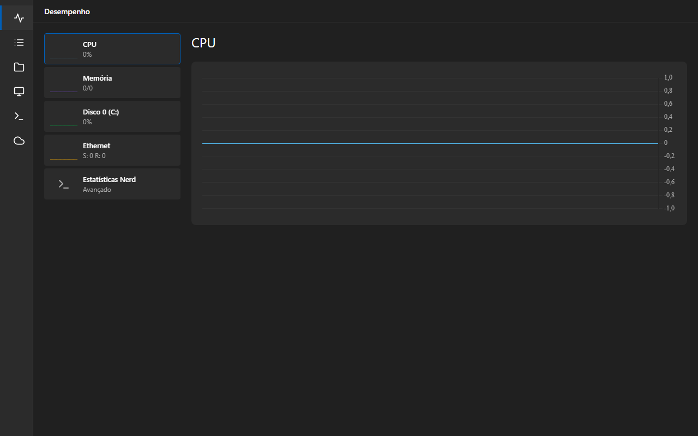
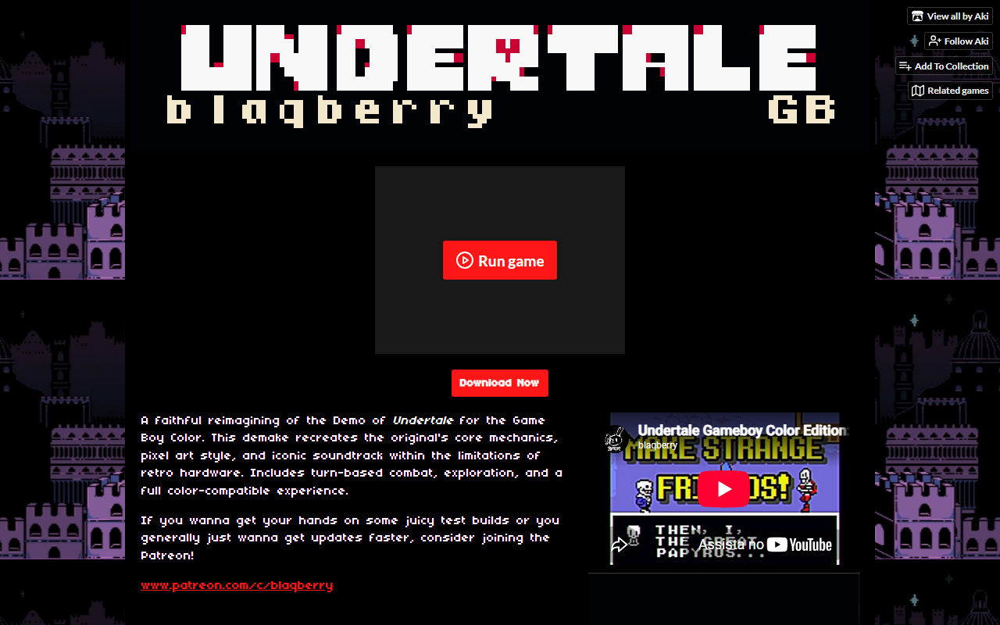

<h1 align="center">
  
</h1>

  

## [  About Me ]

   I am a <strong>Software Engineering Student & Researcher</strong> focused on high-performance backend systems, scalable cloud infrastructure, and full-stack web development.  
   My technical experience spans across <strong>Systems Programming, API Design, and High-Throughput Data Processing</strong>.  
   I design and maintain highly available environments utilizing <strong>Containers, Kubernetes, and Modern DevOps Practices</strong>.  
   Continually expanding my knowledge in <strong>C, Python, Computer Architecture, Opcodes, and SIMD Hardware Optimization</strong>.  
   Started my journey as a <strong>Scratch Creator</strong>, which ignited my lifelong passion for game development and logic.

## [  Tech Stack ]

### Low-Level & Systems

  
  
  
  
  
  
  
  

### Frontend Web & UI

  
  
  
  
  
  
  
  
  
  

### Backend, APIs & Data

  
  
  
  
  
  
  
  
  
  

### Databases

  
  
  
  
  
  
  

### Infrastructure, DevOps & Tools

  
  
  
  
  
  
  
  
  
  
  
  
  
  
  
  
  
  
  
  
  

---

## [  Hardware & Projects ]

<table align="center" style="border-collapse: collapse;">
  <tr>
    <td align="center" width="50%">
      
       <strong>M5StickC Plus2 Developer</strong> 
      Developing IoT automation and pushing custom firmwares to <a href="https://m5burner.m5stack.com/">M5Burner</a>.
    </td>
    <td align="center" width="50%">
      
       
      
       <strong>Chiptune & GameDev</strong> 
      Core Contributor & Composer for the <a href="https://blaqberry.itch.io/undertale-gbc">Undertale GB (GBC)</a> project and active maintainer of a modified <strong>FamiStudio Fork</strong> for custom audio synthesis.
    </td>
  </tr>
</table>

## [  Retro Emulation ]

  I am profoundly passionate about <strong>Retro Emulation and Chiptune music</strong>. From exploring the 8-bit audio channels of the NES (Famicom) and Game Boy, to running full emulation stacks for classic 3D graphics, my fascination with low-level systems is heavily inspired by video game hardware history.

### Hardware & Emulation Targets

  <!-- Nintendo -->
  
  
  
  
  
  
  
  
  
  
  <!-- Sega -->
  
  
  <!-- PlayStation -->
  
  
  
  
  <!-- Xbox -->
  
  

## [  Featured Work & Deployments ]

<table align="center" style="border-collapse: collapse;">
  <tr>
    <td align="center" width="50%">
      
       <strong>Cloud Server Dashboard & Web PTY</strong>
    </td>
    <td align="center" width="50%">
      
       <strong>Mapeamento Cultural</strong>
    </td>
  </tr>
  <tr>
    <td align="center" width="50%">
      
       <strong>Carnaval Feminino (Interactive Web)</strong>
    </td>
    <td align="center" width="50%">
      
       <strong>Undertale GB (GameDev & Chiptune)</strong>
    </td>
  </tr>
</table>

## [  Overview & Activity ]

  
  

  
  
  
  
  

## [  Contributions ]
<picture>
  <source media="(prefers-color-scheme: dark)" srcset="https://raw.githubusercontent.com/comeraperuibe944/comeraperuibe944/output/github-contribution-grid-snake-dark.svg">
  <source media="(prefers-color-scheme: light)" srcset="https://raw.githubusercontent.com/comeraperuibe944/comeraperuibe944/output/github-contribution-grid-snake.svg">
  
</picture>

  

